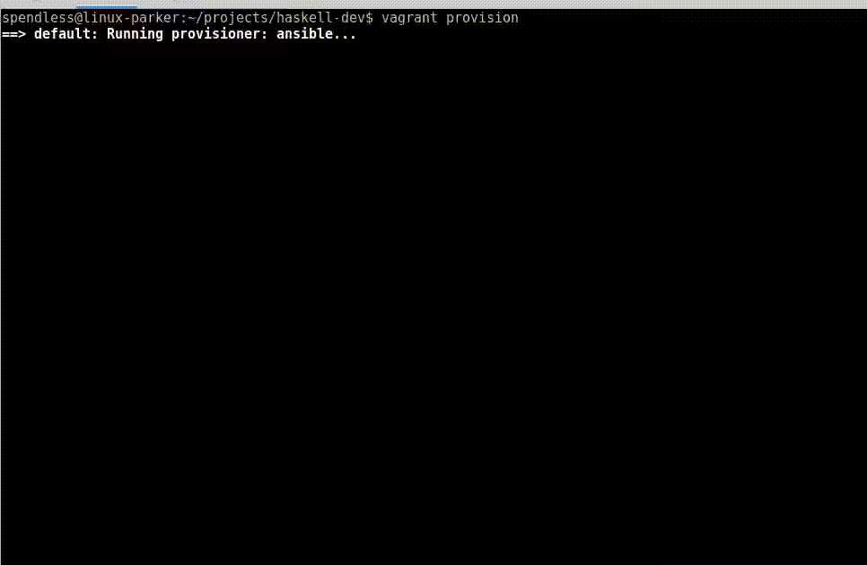
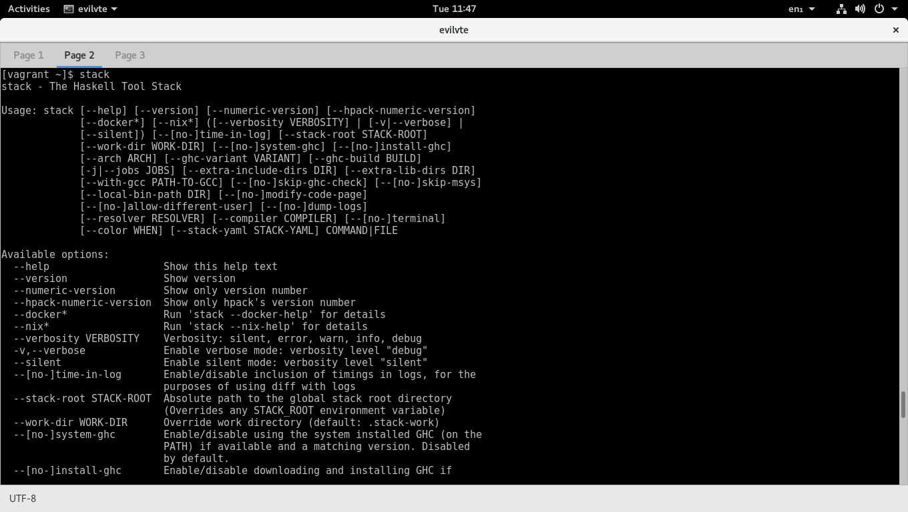

# vagrant-stack-haskell
*Vagrant box backed by Virtualbox, with Ansible provisioning*

A Vagrant box with Ansible provisioning for setting up a Stack and Vim-based Haskell development environment.
Relies heavily upon Stephen Diehl's [article](http://www.stephendiehl.com/posts/vim_2016.html) and his 
[haskell-vim-proto](https://github.com/sdiehl/haskell-vim-proto) repo. We are basically packing all of that config
into a vagrant box.

#### This particular box has only been tested using an *Archlinux* host.




### Notes:
- Some simple config can be managed from `settings.yml`.
- This box assumes that 192.168.1.5 is available on the local network and bridges to it so that any haskell programs opening ports on that interface will be visible from anyone on the lan. To change this ip address, edit `Vagrantfile`.
- This box also opens up an interface that could be hooked into with the host's host file (/etc/hosts), which could also be changed by editing the `Vagrantfile`.
- This box opens up two ports to localhost which can be changed by editing `Vagrantfile`.
- Creates 4GB swap file to avoid compiler errors. You may like to change the ram allocated to the guest instead.

## Ingredients

- [Ubuntu 14.04 "trusty" LTS 64bit base image](http://www.ubuntu.com/)
- [Stack](https://docs.haskellstack.org/)
- [Vim](http://www.vim.org/)
- [Git](http://git-scm.com/)
- [haskell-vim-proto](https://github.com/sdiehl/haskell-vim-proto)

## Prerequisites

- [Vagrant](https://www.vagrantup.com/)
- [Ansible](http://www.ansible.com/)
- [VirtualBox](https://www.virtualbox.org/)

### Installing the requirements
### Archlinux

1. Install Virtualbox:
	```bash
	sudo pacman -S virtualbox
	```

2. Install ansible:
   ```bash
   sudo pacman -S ansible
   ```

3. Install Vagrant
   ```bash
   sudo pacman -S vagrant
   ```

4. Install Net-tools (Optional: install if you have network issues between host and guest)
   ```bash
   sudo pacman -S net-tools
   ```

### Ubuntu (tested with 14.04)

1. Install Virtualbox:
	```bash
	sudo apt-get install virtualbox
	```

2. Install a recent version of ansible:
   ```bash
   sudo apt-get install ansible/trusty-backports
   ```

   *(if you ubuntu version is "trusty", otherwise, replace it with your appropriate version)*
3. Install Vagrant, by first downloadng the proper .deb file from [vagrantup.com](https://www.vagrantup.com/downloads.html)

4. ... and then installing it with:
	```bash
	sudo dpkg -i <deb-file>
	```

## Setup and Usage

#### Clone the github repository:

```bash
git clone https://github.com/sunwukonga/vagrant-stack-haskell.git
cd vagrant-stack-haskell
```

#### Bring up the VM

```bash
vagrant up
```

#### Log in to the VM

```bash
vagrant ssh
```

#### Create a new haskell project

```bash
stack new my-project
cd my-project
stack setup
stack build
stack exec my-project-exe
```

## References

- Stephen Diehl's [article](http://www.stephendiehl.com/posts/vim_2016.html)
- [haskell-vim-proto](https://github.com/sdiehl/haskell-vim-proto) repo
